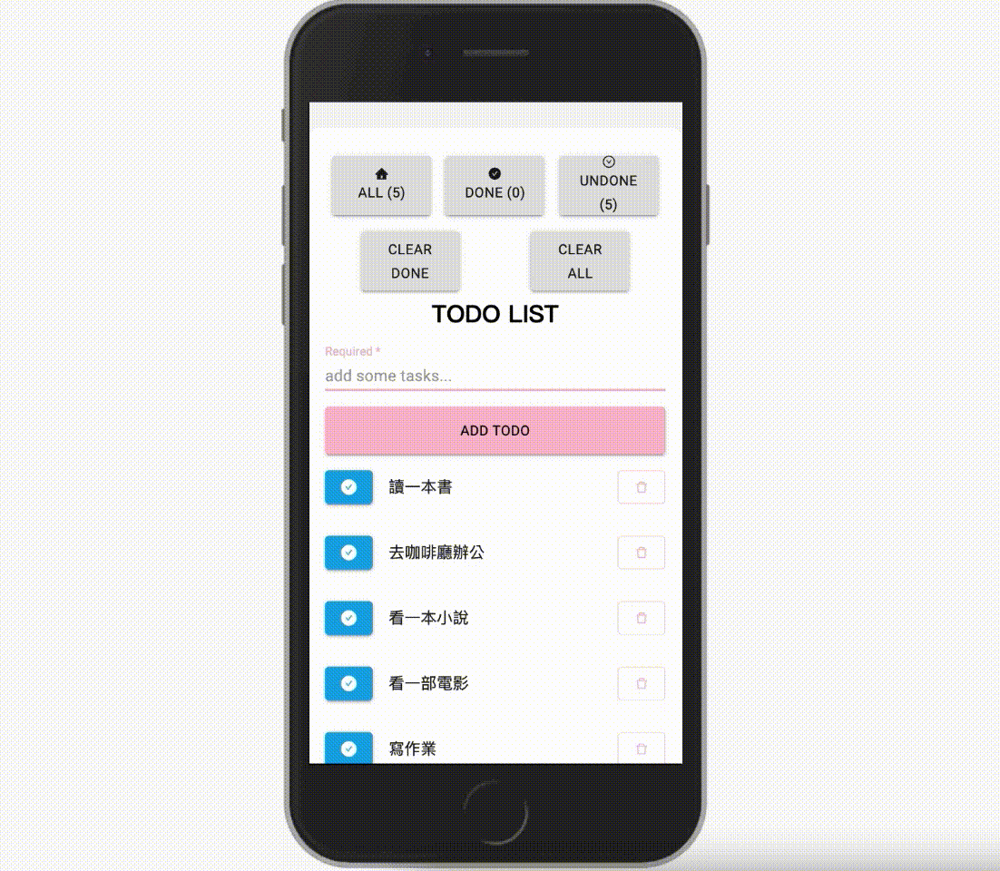

# TodoList with React
## 一個用 React Hooks 製作的 TodoList
作品網址：https://roroiii.github.io/react-todolist/

## User Story
1. 身為一個使用者，我希望 TodoList 的內容可以儲存在本地端，這樣我才能方便修改
2. 身為一個使用者，我希望 TodoList 可以管理 todo，這樣我才能方便修改
3. 身為一個使用者，我希望 TodoList 可以新增 todo，並支援中文輸入
4. 身為一個使用者，我希望 TodoList 可以編輯 todo，並支援中文輸入
5. 身為一個使用者，我希望 TodoList 可以刪除 todo
6. 身為一個使用者，我希望 todo 可以標記完成 / 未完成的狀態
7. 身為一個使用者，我希望 TodoList 可以一鍵清除所有已完成的 odos
8. 身為一個使用者，我希望 TodoList 可以篩選 todo 的狀態為全部、未完成、已完成

### `功能`

1. 新增 todo
2. 編輯 todo
3. 刪除 todo
4. 標記完成 / 未完成
5. 清空 todo
6. 篩選 todo（全部、未完成、已完成）

- 自動暫存在本機
- 支援中文輸入，支援 Enter 鍵新增 todo 
- 支援基本的行動裝置 RWD

