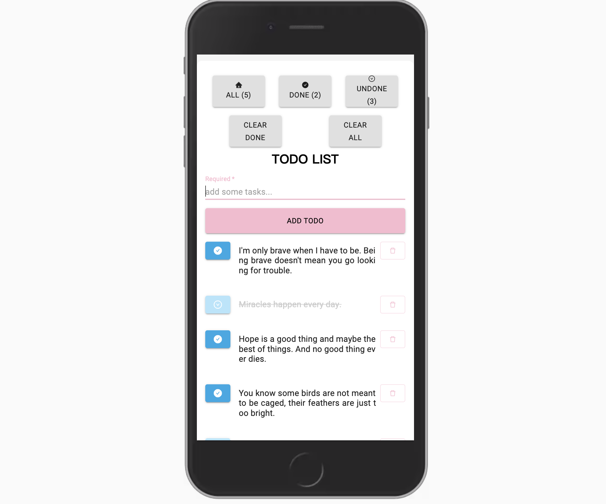

# TodoList with React
## 一個用 React Hooks 製作的 TodoList

### `功能`

1. 新增 todo
2. 編輯 todo
3. 刪除 todo
4. 標記完成 / 未完成
5. 清空 todo
6. 篩選 todo（全部、未完成、已完成）

- 自動暫存在本機
- 支援中文輸入，支援 Enter 鍵新增 todo 
- 支援基本的行動裝置 RWD

